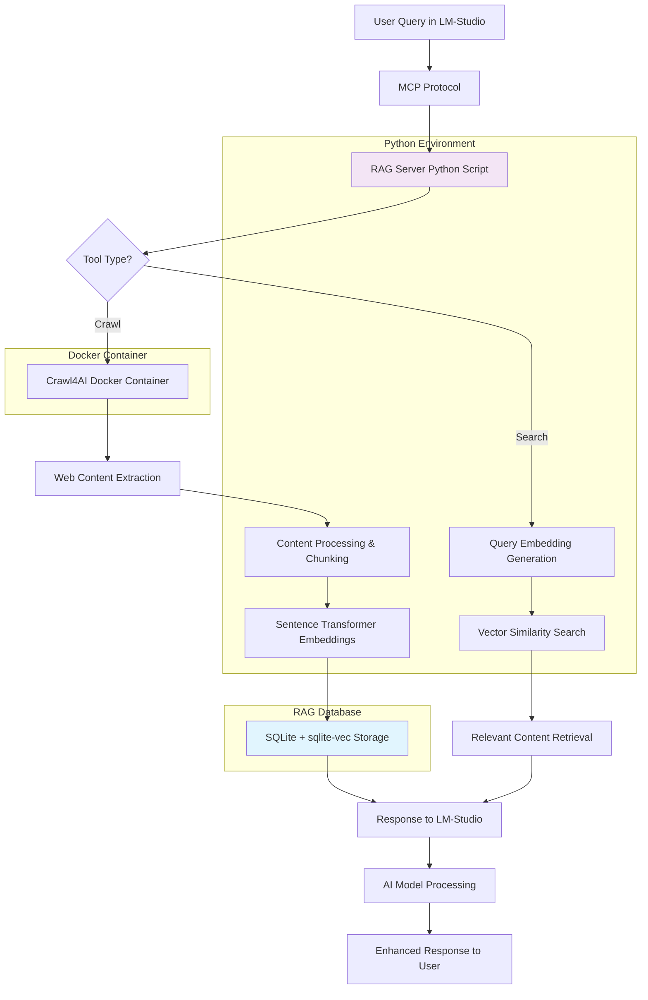

# Crawl4AI RAG MCP Server

A complete Retrieval-Augmented Generation (RAG) system using Crawl4AI for web content extraction, sqlite-vec for vector storage, and LM-Studio MCP integration.

## Overview

This implementation adds a REST API layer that enables bidirectional communication between local MCP servers and remote deployments. The system can operate in two modes:

- **Server Mode**: Hosts REST API endpoints for remote clients
- **Client Mode**: Forwards MCP tool calls to a remote REST API server

The RAG system includes advanced deep crawling capabilities using depth-first search (DFS) to automatically discover and process multiple interconnected pages.

## Homelab Deployment

This system is designed for local homelab deployment and can run entirely on your personal computer or home server without requiring cloud infrastructure.

## Quick Start

### 1. Install Dependencies

```bash
pip install -r requirements.txt
```

### 2. Configure Environment

Copy and edit the `.env` file:

```bash
# For Server Mode (hosting the API)
IS_SERVER=true
LOCAL_API_KEY=your-secure-api-key-here

# For Client Mode (forwarding to remote)
IS_SERVER=false
REMOTE_API_URL=https://your-server.com:8080
REMOTE_API_KEY=your-remote-api-key-here
```

### 3. Run in Server Mode

```bash
# Option 1: Using the startup script
python3 start_api_server.py

# Option 2: Using uvicorn directly
uvicorn api.api:create_app --host 0.0.0.0 --port 8080
```

### 4. Run in Client Mode

```bash
# The existing MCP server automatically detects client mode
python3 core/rag_processor.py
```

## Documentation

- [API Reference](api/)
- [Docker Setup Guide](docker/)
- [Quick Start Guide](guides/quick-start.md)
- [Deployment Guide](guides/deployment.md)
- [Troubleshooting](guides/troubleshooting.md)

## Architecture



## Security Features

- **API Key Authentication**: Bearer token authentication for all endpoints
- **Rate Limiting**: Configurable requests per minute per API key
- **Input Validation**: Pydantic models for request validation
- **URL Validation**: Prevents access to internal/private networks
- **HTTPS Support**: Configurable CORS and security headers
- **Session Management**: Automatic cleanup of expired sessions

## Error Handling

The system includes comprehensive error logging to `crawl4ai_rag_errors.log` with format:

```
timestamp|function_name|url|error_message|error_code|stack_trace
```

All major functions include try-catch blocks with detailed error logging for debugging and monitoring.
