# Crawl4AI RAG MCP Server Documentation

A high-performance Retrieval-Augmented Generation (RAG) system using Crawl4AI for web content extraction, sqlite-vec for vector storage, and MCP integration for AI assistants.

## Overview

This is a production-ready RAG system that provides:

- **High Performance**: RAM database mode with 10-50x faster queries via differential sync
- **Semantic Search**: Vector-based content retrieval with 384-dimensional embeddings
- **MCP Integration**: Full MCP protocol support for AI assistants (LM-Studio, Claude Desktop, etc.)
- **REST API**: Complete REST API with 15+ endpoints for remote access
- **Security**: Multi-layered input sanitization and domain blocking
- **Batch Processing**: Advanced batch crawler with retry logic and progress tracking

## Operation Modes

The system can operate in two modes:

- **Server Mode**: Hosts REST API endpoints and MCP server locally
- **Client Mode**: Forwards MCP tool calls to a remote REST API server

## Key Features

- **RAM Database Mode**: In-memory SQLite with differential sync for ultra-fast queries
- **Deep Crawling**: DFS-based multi-page crawling with depth and page limits
- **Input Sanitization**: Comprehensive SQL injection defense and validation
- **Domain Blocking**: Wildcard-based blocking with social media and NSFW filters
- **Batch Operations**: High-performance batch crawling with automatic retry
- **Vector Search**: Semantic search with tag filtering and deduplication

## Quick Start

### 1. Install Dependencies

```bash
pip install -r requirements.txt
```

### 2. Configure Environment

Copy and edit the `.env` file:

```bash
# For Server Mode (hosting the API)
IS_SERVER=true
USE_MEMORY_DB=true
LOCAL_API_KEY=your-secure-api-key-here

# For Client Mode (forwarding to remote)
IS_SERVER=false
REMOTE_API_URL=https://your-server.com:8080
REMOTE_API_KEY=your-remote-api-key-here
```

### 3. Run in Server Mode

```bash
# Option 1: Using the startup script
python3 deployments/server/start_api_server.py

# Option 2: Using uvicorn directly
uvicorn api.api:create_app --host 0.0.0.0 --port 8080

# Option 3: Using Docker
docker compose -f deployments/server/docker-compose.yml up -d
```

### 4. Run in Client Mode

```bash
# The existing MCP server automatically detects client mode
python3 core/rag_processor.py
```

## Documentation

### Getting Started
- **[Installation Guide](README.md)** - Detailed setup instructions
- **[Quick Start Guide](guides/quick-start.md)** - Get up and running quickly
- **[Deployment Guide](deployments.md)** - Comprehensive deployment options (Server, Client, Docker)

### API Documentation
- **[API Overview](api/index.md)** - REST API introduction and concepts
- **[API Endpoints](api/endpoints.md)** - Complete endpoint reference with examples
- **[API Reference](API_README.md)** - Legacy API documentation

### Advanced Features
- **[RAM Database Mode](advanced/ram-database.md)** - In-memory database with differential sync
- **[Security Features](advanced/security.md)** - Input sanitization and domain blocking
- **[Batch Operations](advanced/batch-operations.md)** - Batch crawling and database restoration

### Guides
- **[Docker Setup](docker/)** - Docker deployment and configuration
- **[Troubleshooting](guides/troubleshooting.md)** - Common issues and solutions

## Architecture


## Security Features

- **Input Sanitization**: Multi-layered SQL injection defense and validation (see [Security Guide](advanced/security.md))
- **Domain Blocking**: Wildcard-based domain blocking with social media and NSFW filters
- **API Key Authentication**: Bearer token authentication for all endpoints
- **Rate Limiting**: Configurable requests per minute per API key
- **Input Validation**: Pydantic models for request validation
- **URL Validation**: Prevents access to internal/private networks and blocked domains
- **HTTPS Support**: Configurable CORS and security headers
- **Session Management**: Automatic cleanup of expired sessions

## Performance Features

- **RAM Database Mode**: In-memory SQLite with differential sync (see [RAM Database Guide](advanced/ram-database.md))
  - 10-50x faster query performance
  - Automatic idle sync (5 seconds) and periodic sync (5 minutes)
  - Change tracking via triggers and shadow tables
- **Vector Search**: 384-dimensional embeddings with similarity search
- **Batch Processing**: Concurrent crawling with retry logic (see [Batch Operations Guide](advanced/batch-operations.md))
- **Content Deduplication**: URL-based deduplication in search results
- **Efficient Storage**: Markdown conversion and content chunking

## Error Handling

The system includes comprehensive error logging to `crawl4ai_rag_errors.log` with format:

```
timestamp|function_name|url|error_message|error_code|stack_trace
```

All major functions include try-catch blocks with detailed error logging for debugging and monitoring.

