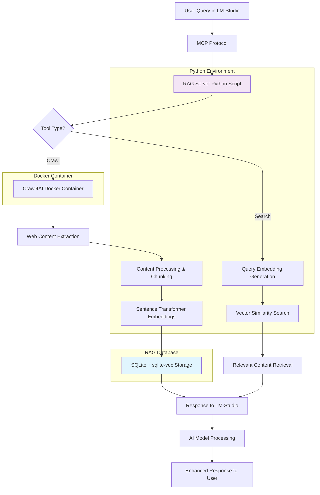

# Crawl4AI RAG MCP Docker Server Guide

A complete Docker-based setup for a Retrieval-Augmented Generation (RAG) system using Crawl4AI, sqlite-vec, and MCP integration with OpenWebUI support.

## Homelab Deployment

This system is designed for local homelab deployment and can run entirely on your personal computer or home server without requiring cloud infrastructure.

## Quick Start with Docker

### Prerequisites
- Docker and docker-compose installed
- At least 4GB RAM available
- 10GB free disk space

### Build and Deploy

1. **Build the Docker image**:
```bash
docker build -t crawl4ai-mcp-server:latest .
```

2. **Start the services**:
```bash
docker compose up -d
```

3. **Verify services are running**:
```bash
docker compose ps
```

You should see both `crawl4ai` and `crawl4ai-mcp-server` containers running.

## Remote Access via OpenWebUI (Homelab)

The MCP server is accessible remotely via MCPO (MCP-to-OpenAPI proxy) for OpenWebUI integration. This is useful for accessing your homelab system from outside your local network.

### OpenWebUI Connection Setup

1. **Access URL**: `http://your-server-ip:8765/openapi.json`
2. **In OpenWebUI**: Add Connection → OpenAPI
3. **Configuration**:
   - URL: `http://your-server-ip:8765`
   - Auth: Session (no API key required)
   - Name: Any descriptive name

### Available API Endpoints

Once connected, OpenWebUI will have access to all MCP tools via REST API:
- `/crawl_url` - Crawl without storing
- `/crawl_and_remember` - Crawl and store permanently  
- `/crawl_temp` - Crawl and store temporarily
- `/deep_crawl_dfs` - Deep crawl without storing
- `/deep_crawl_and_store` - Deep crawl and store all pages
- `/search_memory` - Semantic search of stored content
- `/list_memory` - List stored content
- `/forget_url` - Remove specific content
- `/clear_temp_memory` - Clear temporary content

## Batch Crawling with Docker

### Running Batch Crawler

To crawl all domains from `domains.txt`:

```bash
docker exec -it crawl4ai-mcp-server python3 batch_crawler.py
```

### Batch Crawler Features

- **Sequential Processing**: Crawls each domain one at a time to avoid overwhelming the system
- **Deep Crawling**: Uses depth 4, up to 250 pages per domain
- **Permanent Storage**: All content stored with 'permanent' retention policy
- **Domain Tagging**: Each domain gets tagged as 'batch_crawl,domain_N'
- **Same Database**: Uses the same SQLite database as the MCP server
- **Progress Tracking**: Shows completion status for each domain

### Pre-configured Domains

The `domains.txt` includes documentation sites for:
- Node.js, npm, ESLint, TSConfig
- .NET 8 Entity Framework
- Axios, Vite
- Crawl4AI, LM Studio
- And more...

### Monitoring Batch Progress

```bash
# Watch batch crawler logs
docker logs -f crawl4ai-mcp-server

# Check database statistics
docker exec -it crawl4ai-mcp-server python3 dbstats.py
```

## Docker Architecture

```
┌─────────────────┐    ┌──────────────────────┐
│   Crawl4AI      │    │  MCP Server + MCPO   │
│   Container     │◄───┤  Container           │
│   Port: 11235   │    │  Port: 8765          │
└─────────────────┘    └──────────────────────┘
                                │
                       ┌────────▼────────┐
                       │   Data Volume   │
                       │  ./data:/app/   │
                       │     data/       │
                       └─────────────────┘
```

### Service Details

**crawl4ai container**:
- Runs official Crawl4AI Docker image
- Handles web content extraction
- Internal network communication only

**mcp-server container**:
- Custom-built container with Python dependencies
- Runs both MCP server and MCPO proxy
- Exposes port 8765 for OpenWebUI access
- Mounts `./data` for database persistence

### Database Management

**Database Location**: `./data/crawl4ai_rag.db` (persisted on host)
**Migration**: Copy existing database to `./data/` directory
**Backup**: Regular SQLite backup of the data directory

## Manual Database Operations

### Database Statistics
```bash
docker exec -it crawl4ai-mcp-server python3 dbstats.py
```

### Direct Database Access
```bash
# Access SQLite database directly
docker exec -it crawl4ai-mcp-server sqlite3 /app/data/crawl4ai_rag.db

# Example queries
.tables
SELECT COUNT(*) FROM crawled_content;
SELECT url, title, timestamp FROM crawled_content LIMIT 5;
```

### Backup and Restore
```bash
# Backup database
cp ./data/crawl4ai_rag.db ./data/crawl4ai_rag.db.backup

# Restore from backup
cp ./data/crawl4ai_rag.db.backup ./data/crawl4ai_rag.db
```

---

# Complete Setup Guide (Legacy Non-Docker)

## Prerequisites

- Ubuntu/Linux system or other Linux distribution
- Docker and docker-compose installed
- Python 3.8 or higher
- LM-Studio installed
- At least 4GB RAM available
- 10GB free disk space

## Homelab Setup Guide

This system is designed for local homelab deployment. It can run entirely on your personal computer or home server without requiring cloud infrastructure.

### Step 1: Setup Docker Container

Create the Docker configuration for Crawl4AI:

```bash
# Create docker-compose.yml
cat > docker-compose.yml << 'EOF'
services:
  crawl4ai:
    image: unclecode/crawl4ai:latest
    container_name: crawl4ai
    ports:
      - "11235:11235"
    shm_size: '1gb'
    restart: unless-stopped
    healthcheck:
      test: ["CMD", "curl", "-f", "http://localhost:11235/"]
      interval: 30s
      timeout: 10s
      retries: 3
    environment:
      - LOG_LEVEL=INFO
EOF

# Start the container
docker-compose up -d

# Verify container is running
docker-compose ps
```

### Step 2: Test Docker Container

Verify the Crawl4AI container is working:

```bash
# Wait for container to be healthy
sleep 30

# Test basic connectivity
curl http://localhost:11235/

# Test crawling functionality
curl -X POST http://localhost:11235/crawl \
  -H "Content-Type: application/json" \
  -d '{"urls": ["https://httpbin.org/html"]}'
```

Expected response should include `"success": true` and crawled content.

### Step 3: Create Python Virtual Environment

```bash
# Create virtual environment
python3 -m venv crawl4ai_rag_env

# Activate environment
source crawl4ai_rag_env/bin/activate

# Upgrade pip
pip install --upgrade pip
```

### Step 4: Install Dependencies

Install all required Python packages:

```bash
# Core dependencies
pip install sentence-transformers==5.1.0
pip install sqlite-vec==0.1.6
pip install numpy==2.3.2
pip install requests==2.32.5

# Additional dependencies that may be required
pip install torch torchvision torchaudio --index-url https://download.pytorch.org/whl/cpu
pip install transformers==4.56.1
pip install huggingface-hub
```

### Step 5: Test sqlite-vec Installation

Run the test script to verify sqlite-vec is working:

# Run the test

```
python test_sqlite_vec.py
```

### Step 6: Test Sentence Transformers

Verify the sentence transformer model loads correctly:

```bash
python -c "
from sentence_transformers import SentenceTransformer
print('Loading model...')
model = SentenceTransformer('all-MiniLM-L6-v2')
print('✓ Model loaded successfully')
test_text = ['Hello world', 'Testing embeddings']
embeddings = model.encode(test_text)
print(f'✓ Embeddings generated: {embeddings.shape}')
"
```

### Step 7: Add RAG Server Script

Create the main RAG server script. Copy the complete `crawl4ai_rag_optimized.py` script to your home directory and make it executable:

```bash
# Make script executable
chmod +x crawl4ai_rag_optimized.py

# Test script initialization
python crawl4ai_rag_optimized.py &
SCRIPT_PID=$!
sleep 5
kill $SCRIPT_PID

# You should see:
# Initializing RAG system...
# RAG system ready!
```

### Step 8: Test RAG Server Manually

Test the MCP server with manual JSON-RPC calls:

```bash
# Test tools listing
echo '{"jsonrpc": "2.0", "id": 1, "method": "tools/list"}' | python crawl4ai_rag_optimized.py

# Test crawling and storing
echo '{"jsonrpc": "2.0", "id": 2, "method": "tools/call", "params": {"name": "crawl_and_remember", "arguments": {"url": "https://httpbin.org/html"}}}' | python crawl4ai_rag_optimized.py

# Test search functionality
echo '{"jsonrpc": "2.0", "id": 3, "method": "tools/call", "params": {"name": "search_memory", "arguments": {"query": "test content"}}}' | python crawl4ai_rag_optimized.py
```

### Step 9: Configure LM-Studio MCP

Update LM-Studio's MCP configuration file:

```bash
# Get the full paths
VENV_PATH=$(pwd)/crawl4ai_rag_env
SCRIPT_PATH=$(pwd)/crawl4ai_rag_optimized.py

echo "Virtual Environment: $VENV_PATH"
echo "Script Path: $SCRIPT_PATH"
```

In LM-Studio, go to **Program → View MCP Configuration** and update `mcp.json`:

# Option 1, point it to your python location if necessary

```json
{
  "mcpServers": {
    "crawl4ai-rag": {
      "command": "/home/YOUR_USERNAME/crawl4ai_rag_env/bin/python",
      "args": ["/home/YOUR_USERNAME/crawl4ai_rag_optimized.py"],
      "env": {
        "PYTHONPATH": "/home/YOUR_USERNAME/crawl4ai_rag_env/lib/python3.11/site-packages"
      }
    }
  }
}
```

# Option 2: If you are working in an active venv

```json
{
  "mcpServers": {
    "crawl4ai-rag": {
      "command": "/home/robiloo/crawl4ai_rag_env/bin/python3",
      "args": ["/home/robiloo/crawl4ai_rag_optimized.py"]
    }
  }
}
```

Replace `YOUR_USERNAME` with your actual username and adjust Python version as needed.

### Step 10: Verify LM-Studio Integration

1. **Restart LM-Studio completely** (close and reopen)
2. **Check Integrations panel** - should show `crawl4ai-rag` with blue toggle
3. **Verify available tools**:

   **Basic Tools:**
   - `crawl_url` - Crawl single page without storing
   - `crawl_and_remember` - Crawl single page and store permanently
   - `crawl_temp` - Crawl single page and store temporarily
   
   **Deep Crawling Tools:**
   - `deep_crawl_dfs` - Deep crawl multiple pages without storing (preview only)
   - `deep_crawl_and_store` - Deep crawl and store all pages permanently
   
   **Knowledge Management:**
   - `search_memory` - Search stored content using semantic similarity
   - `list_memory` - List all stored content
   - `forget_url` - Remove specific content by URL
   - `clear_temp_memory` - Clear session content

4. **Test with simple command**: "List what's in memory"

## Deep Crawling Features

The RAG system includes advanced deep crawling capabilities using depth-first search (DFS) to automatically discover and process multiple interconnected pages:

### Deep Crawl Parameters

- **max_depth** (1-5): How many link levels to follow from starting URL
- **max_pages** (1-250): Maximum total pages to crawl 
- **include_external** (true/false): Whether to follow links to external domains
- **score_threshold** (0.0-1.0): Minimum relevance score for pages (currently unused)
- **timeout** (seconds): Maximum time to spend on entire crawl operation

### Deep Crawl Process

1. **Link Discovery**: Extracts up to 5 links per page from HTML content
2. **URL Filtering**: Skips non-content files (.css, .js, images, etc.)
3. **Domain Control**: Optionally restricts to same domain as starting URL
4. **Duplicate Prevention**: Tracks visited URLs to avoid loops
5. **Content Processing**: Each page is crawled, chunked, and embedded individually

### URL Deduplication

- **Automatic Replacement**: Same URL crawled multiple times updates existing record
- **Clean Embeddings**: Old vector embeddings deleted before generating new ones
- **Fresh Content**: Always stores the most recent version of each page
- **No Duplicates**: Database enforces unique constraint on URL field

### Usage Examples

**Quick exploration** (fast, small scope):
```
deep_crawl_dfs with max_depth=2, max_pages=25
```

**Comprehensive documentation crawl**:
```
deep_crawl_and_store with max_depth=3, max_pages=100, include_external=false
```

**Large site analysis**:
```
deep_crawl_and_store with max_depth=4, max_pages=250, timeout=1200
```

## Homelab Considerations

1. **Local Network Access**: The system runs on your local network
2. **No Cloud Costs**: Everything runs locally with no recurring fees
3. **Security**: Configure firewall rules to restrict access to trusted devices
4. **Backup Strategy**: Regular backups of the SQLite database directory
5. **Resource Planning**: Ensure adequate RAM (minimum 4GB) and disk space (10GB+)

## Architecture



## Troubleshooting

### Common Issues

**Container not starting:**

```bash
docker-compose logs crawl4ai
```

**Python import errors:**

```bash
source crawl4ai_rag_env/bin/activate
pip list | grep -E "(sentence|sqlite|numpy|requests)"
```

**MCP connection issues:**

- Check LM-Studio logs in the application
- Verify file paths in mcp.json are absolute
- Ensure script has execute permissions

**Memory issues:**

- Increase Docker container memory if needed
- Monitor system RAM usage during model loading

### Log Files

**Error logs:** `~/crawl4ai_rag_errors.log`
**Docker logs:** `docker-compose logs crawl4ai`
**LM-Studio logs:** Available in LM-Studio application

---

# API Documentation

## RAGDatabase Class

### `__init__(self, db_path: str = None)`

**Purpose:** Initialize the RAG database with SQLite and vector capabilities
**Parameters:**

- `db_path` (str): Path to SQLite database file. Auto-detects Docker environment and uses `/app/data/crawl4ai_rag.db` if in Docker, otherwise defaults to "crawl4ai_rag.db"
  **Functionality:** Sets up database connection, loads sqlite-vec extension, creates tables, generates session ID

### `load_sqlite_vec(self, db)`

**Purpose:** Load the sqlite-vec extension for vector operations
**Parameters:**

- `db` (sqlite3.Connection): Database connection object
  **Returns:** Database connection with vector extension loaded
  **Functionality:** Enables extension loading and loads vec0.so from sqlite-vec package

### `init_database(self)`

**Purpose:** Create database schema for content and vector storage
**Parameters:** None
**Functionality:** Creates tables for crawled_content, sessions, and content_vectors virtual table

### `chunk_content(self, content: str, chunk_size: int = 500, overlap: int = 50) -> List[str]`

**Purpose:** Split content into overlapping chunks for embedding
**Parameters:**

- `content` (str): Text content to chunk
- `chunk_size` (int): Number of words per chunk, default 500
- `overlap` (int): Number of overlapping words between chunks, default 50
  **Returns:** List of text chunks
  **Functionality:** Splits text by words with sliding window approach

### `store_content(self, url: str, title: str, content: str, markdown: str, retention_policy: str = 'permanent', tags: str = '') -> int`

**Purpose:** Store content in database and generate embeddings
**Parameters:**

- `url` (str): Source URL of content
- `title` (str): Page title
- `content` (str): Cleaned HTML content
- `markdown` (str): Markdown version of content
- `retention_policy` (str): Storage policy ('permanent', 'session_only', '30_days')
- `tags` (str): Comma-separated tags for organization
  **Returns:** Content ID of stored item
  **Functionality:** Stores content with metadata, generates embeddings for chunks

### `generate_embeddings(self, content_id: int, content: str)`

**Purpose:** Create vector embeddings for content chunks
**Parameters:**

- `content_id` (int): Database ID of the content
- `content` (str): Text content to embed
  **Functionality:** Chunks content, generates embeddings using sentence transformer, stores in vector table

### `search_similar(self, query: str, limit: int = 5) -> List[Dict]`

**Purpose:** Find semantically similar content using vector search
**Parameters:**

- `query` (str): Search query text
- `limit` (int): Maximum number of results, default 5
  **Returns:** List of dictionaries with url, title, content, timestamp, tags, similarity_score
  **Functionality:** Embeds query, performs vector similarity search, returns ranked results

### `list_content(self, retention_policy: Optional[str] = None) -> List[Dict]`

**Purpose:** List stored content with optional filtering
**Parameters:**

- `retention_policy` (Optional[str]): Filter by policy type, None for all content
  **Returns:** List of content metadata dictionaries
  **Functionality:** Queries database for content list, optionally filtered by retention policy

### `remove_content(self, url: str = None, session_only: bool = False) -> int`

**Purpose:** Remove content from database
**Parameters:**

- `url` (str): Specific URL to remove, None for bulk operations
- `session_only` (bool): Remove only session content if True
  **Returns:** Number of items removed
  **Functionality:** Deletes content based on URL or session criteria

## Crawl4AIRAG Class

### `__init__(self)`

**Purpose:** Initialize the RAG system with database and crawler URL
**Parameters:** None
**Functionality:** Sets Crawl4AI endpoint, initializes RAGDatabase instance

### `crawl_url(self, url: str, return_full_content: bool = False) -> Dict[str, Any]`

**Purpose:** Crawl a URL and return content with optional full content mode
**Parameters:**

- `url` (str): URL to crawl
- `return_full_content` (bool): If True, return full content; if False, return preview
  **Returns:** Dictionary with success status, title, content/preview, and metadata
  **Functionality:** Makes HTTP request to Crawl4AI, processes response, returns appropriate content format

### `crawl_and_store(self, url: str, retention_policy: str = 'permanent', tags: str = '') -> Dict[str, Any]`

**Purpose:** Crawl URL and store content in RAG database
**Parameters:**

- `url` (str): URL to crawl and store
- `retention_policy` (str): Storage policy for content
- `tags` (str): Tags for content organization
  **Returns:** Dictionary with success status, storage confirmation, and content preview
  **Functionality:** Crawls content, stores in database, generates embeddings, returns summary

### `search_knowledge(self, query: str, limit: int = 5) -> Dict[str, Any]`

**Purpose:** Search stored knowledge using semantic similarity
**Parameters:**

- `query` (str): Search query
- `limit` (int): Maximum results to return
  **Returns:** Dictionary with search results and metadata
  **Functionality:** Performs vector search on stored content, returns ranked results

### `deep_crawl_dfs(self, url: str, max_depth: int = 2, max_pages: int = 10, include_external: bool = False, score_threshold: float = 0.0, timeout: int = None) -> Dict[str, Any]`

**Purpose:** Deep crawl multiple pages using depth-first search without storing
**Parameters:**

- `url` (str): Starting URL for deep crawl
- `max_depth` (int): Maximum depth to crawl (1-5, default 2)
- `max_pages` (int): Maximum pages to crawl (1-250, default 10)
- `include_external` (bool): Follow external domain links (default False)
- `score_threshold` (float): Minimum relevance score (0.0-1.0, default 0.0)
- `timeout` (int): Maximum crawl time in seconds (default 300)
  **Returns:** Dictionary with crawl results, page previews, and metadata
  **Functionality:** Discovers links, follows them recursively, returns content previews

### `deep_crawl_and_store(self, url: str, retention_policy: str = 'permanent', tags: str = '', max_depth: int = 2, max_pages: int = 10, include_external: bool = False, score_threshold: float = 0.0, timeout: int = None) -> Dict[str, Any]`

**Purpose:** Deep crawl multiple pages and store all content in RAG database
**Parameters:**

- `url` (str): Starting URL for deep crawl
- `retention_policy` (str): Storage policy ('permanent', 'session_only', etc.)
- `tags` (str): Tags for content organization (auto-adds 'deep_crawl')
- `max_depth` (int): Maximum depth to crawl (1-5, default 2)
- `max_pages` (int): Maximum pages to crawl (1-250, default 10)
- `include_external` (bool): Follow external domain links (default False)
- `score_threshold` (float): Minimum relevance score (0.0-1.0, default 0.0)
- `timeout` (int): Maximum crawl time in seconds (default 300)
  **Returns:** Dictionary with storage results, success/failure counts, and stored page summaries
  **Functionality:** Performs deep crawl then stores all discovered content with embeddings

## MCPServer Class

### `__init__(self)`

**Purpose:** Initialize MCP server with RAG system and tool definitions
**Parameters:** None
**Functionality:** Sets up RAG instance, defines available tools with schemas

### `handle_request(self, request) -> Dict`

**Purpose:** Process incoming MCP JSON-RPC requests
**Parameters:**

- `request` (Dict): JSON-RPC request object
  **Returns:** JSON-RPC response dictionary
  **Functionality:** Routes requests to appropriate handlers (initialize, tools/list, tools/call)

## Available MCP Tools

### `crawl_url`

**Purpose:** Crawl URL without storing content
**Arguments:**

- `url` (string, required): URL to crawl
  **Returns:** Content preview and metadata

### `crawl_and_remember`

**Purpose:** Crawl URL and store permanently in knowledge base
**Arguments:**

- `url` (string, required): URL to crawl
- `tags` (string, optional): Organization tags
  **Returns:** Storage confirmation and content preview

### `crawl_temp`

**Purpose:** Crawl URL and store temporarily (session only)
**Arguments:**

- `url` (string, required): URL to crawl
- `tags` (string, optional): Organization tags
  **Returns:** Storage confirmation and content preview

### `deep_crawl_dfs`

**Purpose:** Deep crawl multiple pages without storing (preview only)
**Arguments:**

- `url` (string, required): Starting URL for deep crawl
- `max_depth` (integer, optional): Maximum depth to crawl (1-5, default 2)
- `max_pages` (integer, optional): Maximum pages to crawl (1-250, default 10)
- `include_external` (boolean, optional): Follow external domain links (default false)
- `score_threshold` (number, optional): Minimum relevance score (0.0-1.0, default 0.0)
- `timeout` (integer, optional): Maximum crawl time in seconds (default 300)
  **Returns:** List of discovered pages with content previews and metadata

### `deep_crawl_and_store`

**Purpose:** Deep crawl multiple pages and store all in knowledge base
**Arguments:**

- `url` (string, required): Starting URL for deep crawl
- `retention_policy` (string, optional): Storage policy (default 'permanent')
- `tags` (string, optional): Organization tags (auto-adds 'deep_crawl')
- `max_depth` (integer, optional): Maximum depth to crawl (1-5, default 2)
- `max_pages` (integer, optional): Maximum pages to crawl (1-250, default 10)
- `include_external` (boolean, optional): Follow external domain links (default false)
- `score_threshold` (number, optional): Minimum relevance score (0.0-1.0, default 0.0)
- `timeout` (integer, optional): Maximum crawl time in seconds (default 300)
  **Returns:** Storage summary with success/failure counts and stored page details

### `search_memory`

**Purpose:** Search stored knowledge using semantic similarity
**Arguments:**

- `query` (string, required): Search query
- `limit` (integer, optional): Number of results (default 5)
  **Returns:** Ranked list of relevant content

### `list_memory`

**Purpose:** List all stored content in knowledge base
**Arguments:**

- `filter` (string, optional): Filter by retention policy
  **Returns:** List of stored content metadata

### `forget_url`

**Purpose:** Remove specific content by URL
**Arguments:**

- `url` (string, required): URL to remove
  **Returns:** Removal confirmation

### `clear_temp_memory`

**Purpose:** Clear all temporary content from current session
**Arguments:** None
**Returns:** Count of removed items

## Error Handling

The system includes comprehensive error logging to `crawl4ai_rag_errors.log` with format:

```
timestamp|function_name|url|error_message|error_code|stack_trace
```

All major functions include try-catch blocks with detailed error logging for debugging and monitoring.
